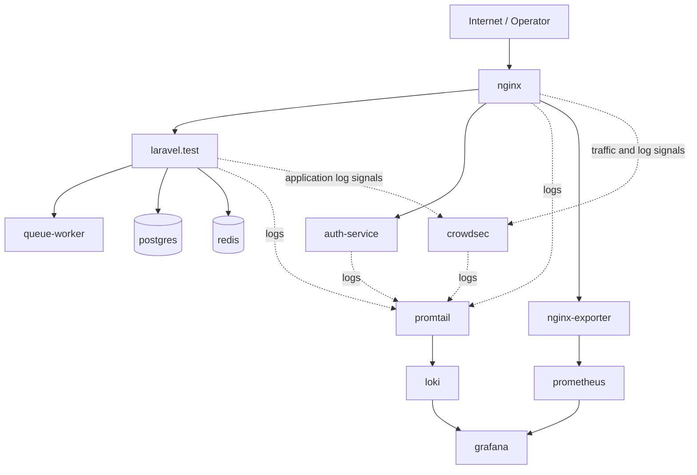
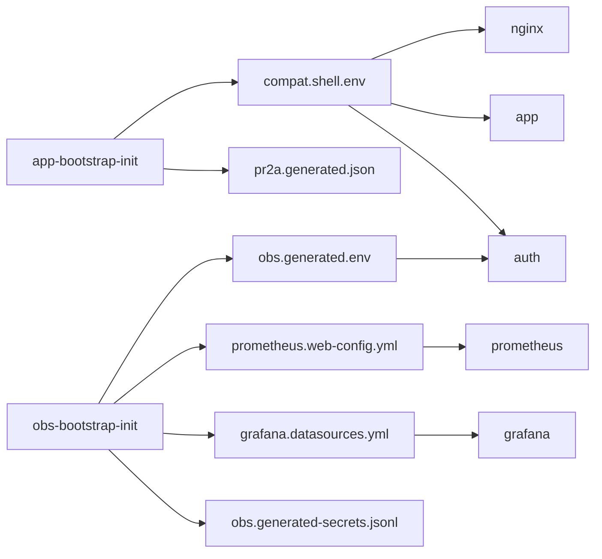
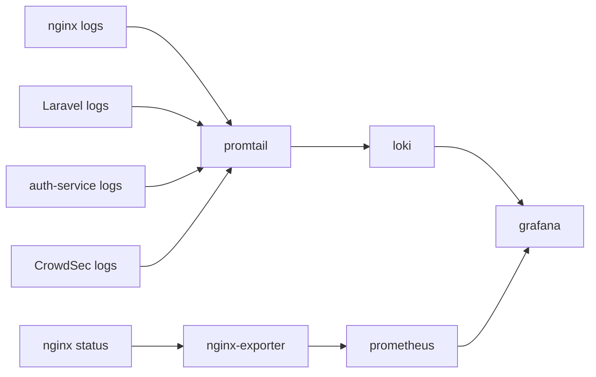

# Architecture

## Overview

The project is structured as a Laravel application with a security and observability wrapper around it. Instead of treating deployment as a single flat application container, the system is divided into business, bootstrap, security, and observability responsibilities.

## High-Level Topology

## Bootstrap Flow

## Observability Flow

## Runtime Layers

### Core business layer

- `nginx`
- `laravel.test`
- `queue-worker`
- `postgres`
- `redis`

This layer is responsible for the actual application traffic, job execution, and data persistence.

### One-time bootstrap layer

- `app-bootstrap-init`
- `obs-bootstrap-init`
- `auth-service-logs-init`
- `grafana-data-init`
- `crowdsec-key-init`

This layer exists to prepare runtime state before the long-running containers start. It reduces hidden startup assumptions and makes generated runtime files explicit.

### Observability layer

- `prometheus`
- `nginx-exporter`
- `loki`
- `promtail`
- `grafana`

This layer handles metrics, logs, dashboards, and evidence surfaces.

### Security and supporting layer

- `auth-service`
- `crowdsec`

This layer supports monitoring access control, audit-related behavior, and security analysis of runtime traffic and logs.

## Runtime State

Generated runtime artifacts are a first-class part of the architecture. Important examples include:

- `.blue-team-vm/runtime/compat.shell.env`
- `.blue-team-vm/runtime/obs.generated.env`
- `.blue-team-vm/rendered/prometheus.web-config.yml`
- `.blue-team-vm/rendered/grafana.datasources.yml`
- `.blue-team-vm/runtime/rendered/*.conf`

See [runbooks/blue-team-vm-runtime-map.md](./runbooks/blue-team-vm-runtime-map.md) for the detailed state map.

## Why this architecture matters

The architecture demonstrates that the project is designed as a defended and observable deployment, not only as a feature-complete application. The separation of responsibilities helps show:

- security boundary thinking
- operational reproducibility
- explicit runtime contracts
- maintainable evidence collection
