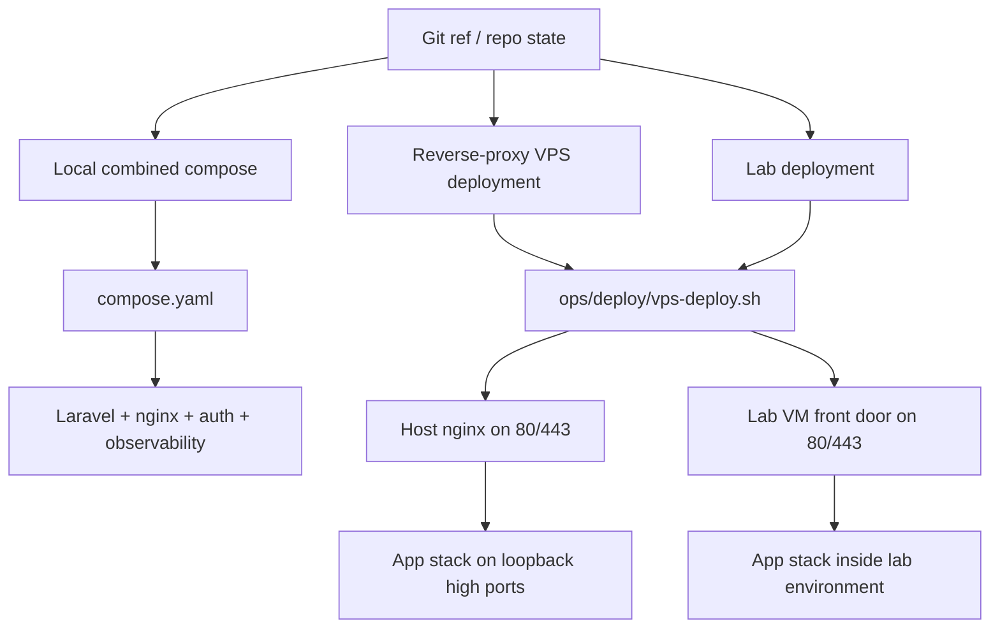
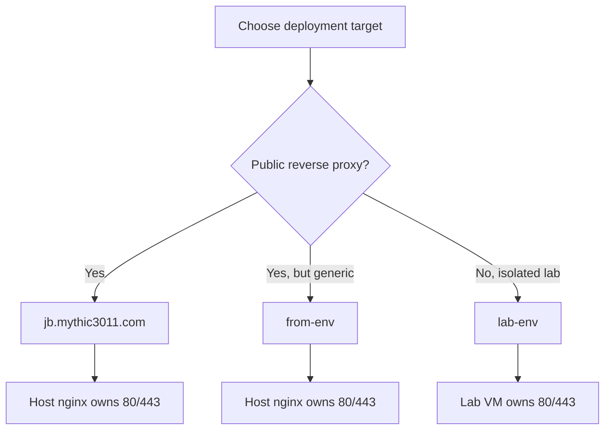

# Deployment

## Deployment model

This project is designed around reproducible Docker-based deployment with profile-driven behavior instead of one-off machine setup.

The deployment story has three main shapes:

- local combined compose bring-up
- reverse-proxy VPS deployment
- lab deployment for isolated security or classroom environments



## Local deployment

The main local operator path is:

```bash
docker compose up -d --build
```

The combined compose surface includes bootstrap services that prepare runtime state before the application, auth, and observability services start.

## Remote deployment

Remote deployment is driven by `ops/deploy/vps-deploy.sh` with profile selection.

Examples:

- named public VPS deployment
- environment-driven reverse-proxy deployment
- lab deployment profile

## Profile Decision Map



The exact profile contract is documented in:

- [runbooks/deploy-profile-guide.md](./runbooks/deploy-profile-guide.md)

## Deployment qualities shown by this repo

- profile-driven deploy behavior
- TLS mode awareness
- reverse-proxy versus lab front-door distinction
- generated runtime artifacts prepared before service startup
- explicit operator-facing contracts instead of implicit machine assumptions

## Deployment takeaway

This repo shows more than "Docker works on my machine." It shows:

- deployment reproducibility
- environment-aware runtime contracts
- operational separation between app, security, and observability services
- documentation that can support verification and demonstration
